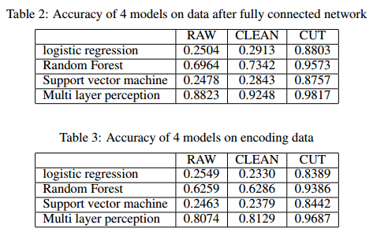

# Classification on Modified MNIST     

This is the code repository of CS420 18spring project by Chen Xinyi and Wang Yiqing.    

## Repository Structure     
- `./data`    
	- npy file for 3 data settings, RAW, CLEAN, CUT. Two sizes for each data setting, 45x45 and 28x28.     
	- use `np.load(filename)` to load the data.   
	- `data_processing.py`, script for data processing    
- `./model`    
	- models of CNN and Capsule net on three data settings.    
- `./src`    
	- CNN and its visualization: `cnn.py`, `vis.py`      
	- Autoencoder: `ae.py`     
	- CapsNet(refer and modify [THIS WORK](https://github.com/XifengGuo/CapsNet-Keras)): `capsulenet.py`, `capsulelayers.py`, `utils.py`     

## Tips     
    
- Unzip the `./model/model.zip` and `./data/data.zip` at first   
- `cnn.py`: To train or test on different data settintg, modify `FILE_TRAIN_IMG` and `FILE_TEST_IMG`     
- `vis.py`: display the activation of layer, modify `main()` to vary the model weights, layer name, and input image    
- `ae.py`:  To train or test on different data settintg, modify `FILE_TRAIN_IMG` and `FILE_TEST_IMG`     
- `capsulenet.py`: See the `ArgumentParser` in `main()`    

## Data Settings     
(a)RAW (b)CLEAN (c)CUT     
    

## Results    
     
    
    
